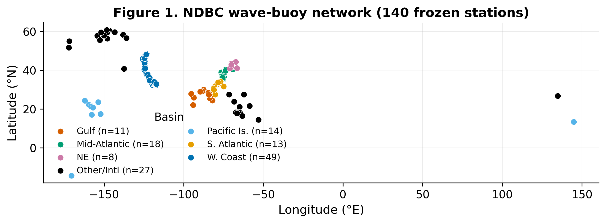
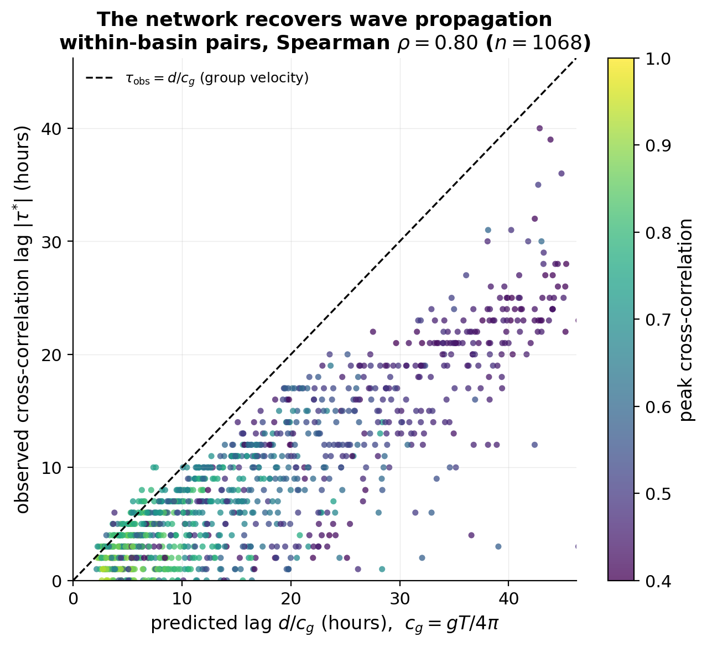
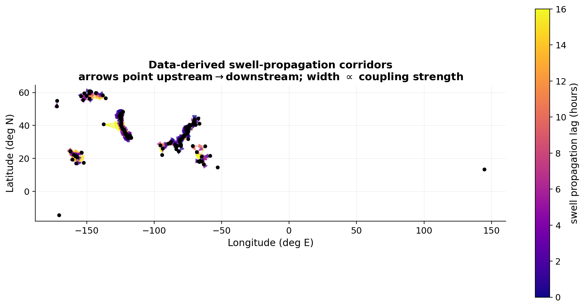
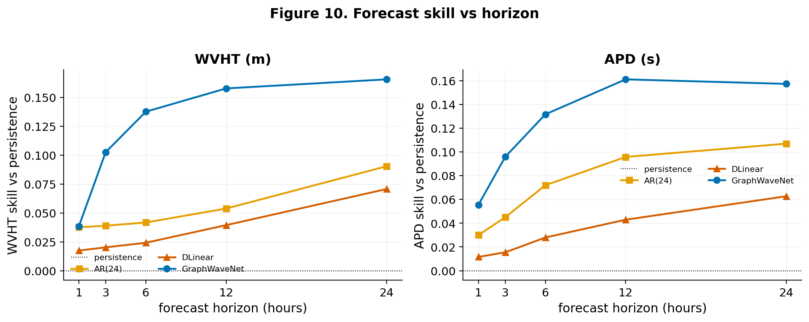
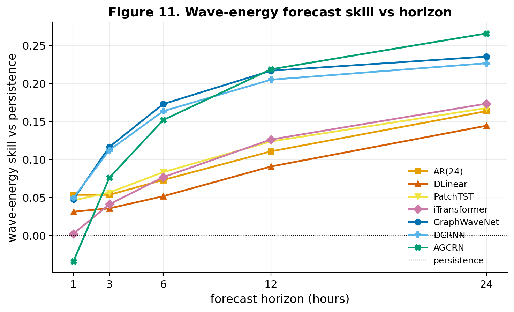

# Spatiotemporal Graph Learning for Ocean Wave Fields

**Imputation, forecasting, and wave-energy estimation across a national buoy network — and the wave physics that explains why spatial graphs win.**

This repository accompanies a study of wave-height and wave-period modelling over the U.S.
National Data Buoy Center (NDBC) network. It brings imputation, multi-horizon forecasting, and
wave-energy estimation into one leakage-safe benchmark, compares classical, temporal-deep, and
spatiotemporal-graph methods, and shows that the advantage of graph models has a concrete
physical origin: **swell propagation between buoys, recovered from data.**

---

## Highlights

- **A national, leakage-safe benchmark.** 140 NDBC buoys, hourly 2021–2025 (43,824 steps),
  significant wave height (WVHT) and average period (APD) as targets, with a pre-registered
  hide-and-recover protocol separating *structured* (whole-station outage, contiguous block) from
  *scattered* (random) missingness.
- **Imputation.** A graph recurrent network (GRIN) wins wherever missingness is structured —
  recovering a completely dark buoy's wave height at **0.346 ± 0.007 m** MAE, well below spatial
  interpolation (0.443 m) and single-station deep models.
- **Forecasting.** Eight models at horizons 1–24 h. The three graph models
  (GraphWaveNet, DCRNN, AGCRN) form a distinct upper tier above all four temporal methods
  (AR(24), DLinear, PatchTST, iTransformer) at every horizon ≥ 6 h — the transformer state of the
  art is no better than a per-station autoregression.
- **The physical explanation (the novel result).** The network's wave-height cross-correlations
  **recover the deep-water dispersion relation from data alone**: observed propagation lags track
  the group-velocity prediction *d/c₉* at Spearman **ρ = 0.80** (99 % respect the causal bound
  *|τ| ≤ d/c₉*), yielding data-derived **swell-corridor maps**. The graph's edge is that it reads
  an upstream buoy as a causal *preview* of arriving swell.
- **Wave energy.** Carrying forecasts through the deep-water power flux, the graph advantage
  *amplifies* (power scales with the square of wave height): graph energy skill reaches +0.23–0.27
  at 24 h versus ≤ +0.17 for every temporal method.

---

## Key figures

**The buoy network spans every U.S. ocean basin.**



**The network recovers wave propagation physics.** Observed cross-correlation lags between
within-basin buoys track the deep-water group-velocity prediction *d/c₉* (ρ = 0.80); no pair
outruns the group velocity.



**Data-derived swell-propagation corridors.** Arrows run from the upstream (leading) buoy to the
downstream buoy, coloured by propagation lag.



**Forecast skill splits cleanly by paradigm.** The graph family (blue/green) sits above every
temporal method at all multi-hour horizons.



**The advantage amplifies in wave energy.**



---

## Methods in brief

| Stage | Approach |
| --- | --- |
| **Data** | National NDBC coverage audit → 140 buoys at ≥ 70 % WVHT coverage over ≥ 3 years; timestamps harmonised to a clean hourly cadence; documented coordinate/basin corrections. |
| **Graph** | *k*-nearest-neighbour geographic graph (*k* = 8) with a local self-tuning Gaussian kernel; a basin-aware variant; and the physics-derived directed swell-propagation graph. |
| **Imputation** | Classical baselines (mean/forward/linear, IDW, spatial+temporal), temporal deep models (SAITS, BRITS), and the graph model GRIN, all scored through identical fixed masks. |
| **Forecasting** | Persistence, AR(24); DLinear, PatchTST, iTransformer; GraphWaveNet, DCRNN, AGCRN — direct multi-horizon (1/3/6/12/24 h), leakage-safe. |
| **Wave energy** | Deep-water flux *P = (ρg²/64π) H² Tₑ*, with *Tₑ = α·APD*; comparative skill is invariant to α. |

Every table and figure in the paper is generated programmatically from the committed result CSVs;
no numbers are hand-entered.

---

## Reproducing the results

```bash
# environment: Python with numpy, pandas, scipy, matplotlib, torch, tsl, torch-geometric
# 1. wave-propagation analysis (physics recovery + corridor maps)
python -m src.features.propagation

# 2. exploratory data-analysis figures
python -m src.features.eda

# 3. imputation / forecasting / energy evaluations (see src/models, src/evaluation)
python -m src.models.baselines
python -m src.models.forecast_models --all
python -m src.evaluation.energy

# 4. rebuild the paper tables/figures and manuscript
python reports/make_forecast_plots.py
python reports/build_paper.py
tectonic reports/main.tex        # -> reports/main.pdf
```

## Repository layout

```
src/
  data/         NDBC download, parsing, coverage audit, station selection
  features/     tensor build, graph construction, EDA, propagation analysis
  models/       imputation (GRIN, SAITS, BRITS, baselines) and forecasting models
  evaluation/   hide-and-recover masking, forecasting eval, wave-energy scoring
reports/
  main.tex, main.bib, build_paper.py   reproducible manuscript
  figures/      publication figures
  *.csv         committed result tables
EVALUATION.md   pre-registered evaluation protocol
```

---

## Authors

**Richel Attafuah**, Department of Statistics, Miami University.
Advisor: Prof. Mahsa Ashouri. Collaborators: Prof. Miao Wang; Shirin Besati (UNC Charlotte).

Target venue: *Renewable Energy*.

## Citation

A citation entry will be added on publication. Until then, please cite this repository.
